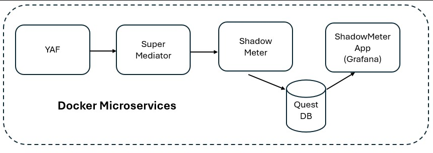

An Network Anomaly Detection System designed for IoT /OT and built with the following microservices:
- [YAF](https://tools.netsa.cert.org/yaf/)
- [SuperMediator](https://tools.netsa.cert.org/super_mediator1/index.html)
- [ShadowMeter](https://github.com/Fidelis-Farm-Technologies/shadowmeter) ([PyTorch](https://www.pytorch.org/)-based anomaly detection engine implemented with [Rust](https://www.rust-lang.org/)).
- [QuestDB](https://questdb.io/download/)
- [Grafana](https://grafana.com/oss/grafana/)

## Motivation
This project is motivated by the following:
* Rust is an ideal language implementing microservices.
* Anomaly detection using PyTorch deep learning algorithmns is an effective way to detect network anomalies.
* YAF captures and generate advanced network flow data suitable for deep learning models.
* SuperMediator extracts advanced features from network flow records.

## Project Schedule
- [&check;] Phase 1 - Build a Docker container images with YAF, SuperMediator, ShadowMeter (analyzer), and Grafana-based application.
- [&check;] Phase 2 - Publish a fully functional (less anomaly detection) network monitoring solution using docker-compose with YAF, SuperMediator, ShadowMeter, QuestDB, and Grafana.
- [&nbsp;] Phase 3 - Add anomaly detection to ShadowMeter using the PyTorch library

## Concept of Operation

1. YAF captures live traffic and generates IPFIX records
2. SuperMediator processes IPF records and converts them to JSON
3. ShadowMeter processes JSON records by analyzing flow records and inserting them into QuestDB
4. Purpose-built Grafana application enables exploration and visualation of network flow traffic
5. Eventually, archive flow records in [Parquet format](https://arrow.apache.org/docs/python/parquet.html) for long term storage and retrieval.
## Docker Image

[DockerHub](https://hub.docker.com/r/fidelismachine/shadowmeter)

````
docker pull fidelismachine/shadowmeter:latest
docker pull fidelismachine/shadowmeter_app:latest
````
- fidelismachine/shadowmeter - includes all the shadowmeter microservices except the grafana
- fidelismachine/shadowmeter_app - grafana-based microservice
---
## Quick Start
Although the anomaly detection (pytorch) functionality is not implemented (yet), you can still run ShadowMeter as a network monitoring probe.  First, create an .env file with the following settings:
```
SHADOWMETER_INTERFACE="eno1"
SHADOWMETER_SENSOR_ID="crozet"
SHADOWMETER_USERNAME="admin"
SHADOWMETER_PASSWORD="quest"
SHADOWMETER_DATABASE="questdb:9009"
```
- SHADOWMETER_INTERFACE -- monitoring network interface
- SHADOWMETER_SENSOR_ID -- unique sensor id label that will appear in the database
- SHADOWMETER_USERNAME --  QuestDB username 
- SHADOWMETER_PASSWORD -- QuestDB password
- SHADOWMETER_DATABASE - QuestDB hostname and port number

Finally, review then run Docker Compose with the docker-compose.yml file included in this repository. 

```
# docker-compose up -d
```

NOTE: All variable file are mapped to ./var in the local direction.  This includes directories for spooling transient files and Grafana.

## Exploring the Database
The [QuestDB Web Console](https://questdb.io/docs/web-console/) makes it easy to explore and chart queries using SQL. All flow records are inserted in the flow table. To connect to to the QuestDB Web Console, first set the following environment variable in the docker-compose.yml:
```
QDB_HTTP_ENABLED=true
```

See the [QuestDb documentation](https://questdb.io/docs/reference/sql/overview/) for more details. 

## Flow Table Schema
| field | type      | description    |
| ----- | -------   | -------------- |
| sid   | symbol    | sensor id      |
| stime | timestamp | start time     |
| ltime | timestamp | last time      |
| proto | long      | protocol       |
| saddr | string    | src IP address |
| sport | long      | src port number|
| daddr | string    | dst IP address |
| dport | long      | dst port number|
| sutcp | string    | union of src TCP flags |
| dutcp | string    | union of dst TCP flags |
| sitcp | string    | initial src TCP flags |
| ditcp | string    | initial dst TCP flags |
| spd | string    | sequence of direction of 1st eight packets |
| vlan | long      | VLAN id|
| sdata | long      | total src data (payload) in bytes|
| ddata | long      | total dst data (payload) in bytes|
| sbytes | long      | total src bytes|
| dbytes | long      | total dst bytes|
| sentropy | long      | entropy of src data |
| dentropy | long      | entropy of dst data |
| siat | long      | src average interarrivate time |
| diat | long      | dst average interarrivate time |
| reason | string    | flow termination reason |
| applabel | string    | application label |
| timestamp | timestamp | record insertion time      |

## ShadowMeter Application
The ShadowMeter Project includes a [custom Grafana-based docker image](https://hub.docker.com/repository/docker/fidelismachine/shadowmeter_app/general) for visualizing and analyzing flow-base network traffic.  

See the shadowmeter_app section in docker-compose.yml file included in this project for details, then refer to the [QuestDB - Grafana tutorial](https://questdb.io/blog/time-series-monitoring-dashboard-grafana-questdb/) to learn how to interact and build custom dashboard.


## Community

For more information join the community at our [blog](https://www.shadowmeter.io).


&copy;2024 Fidelis Farm & Technologies, LLC.
